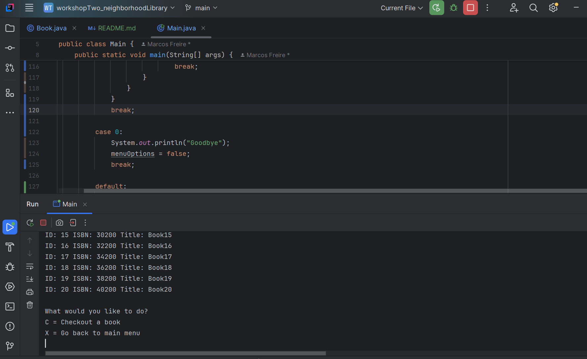
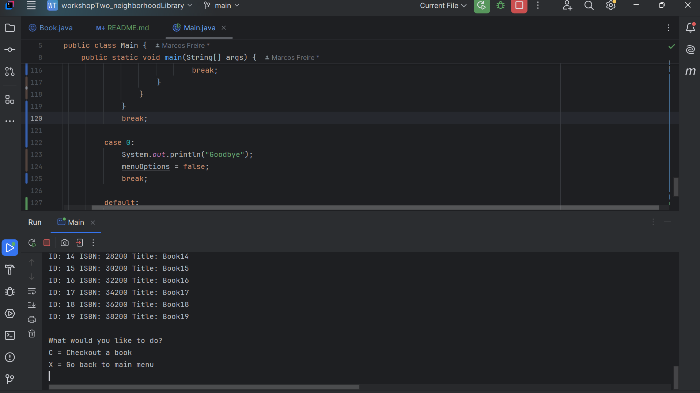
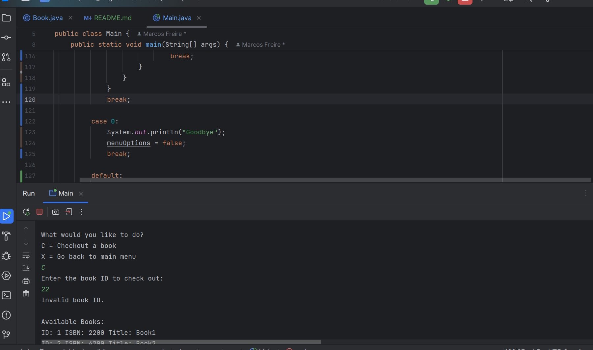
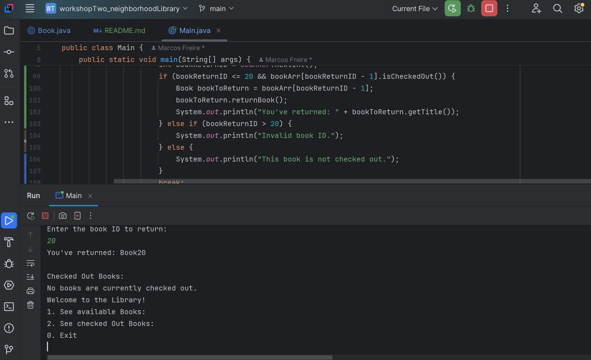

# Neighborhood Library 
So in this project I used a library system for the 
user to rent and return a book. User can see all the options and can either rent or return the book they desire. 

# Main menu

# Book checked out

# Error for when user puts in the wrong ID

# Book returned

Menu for when user wants to return a book

